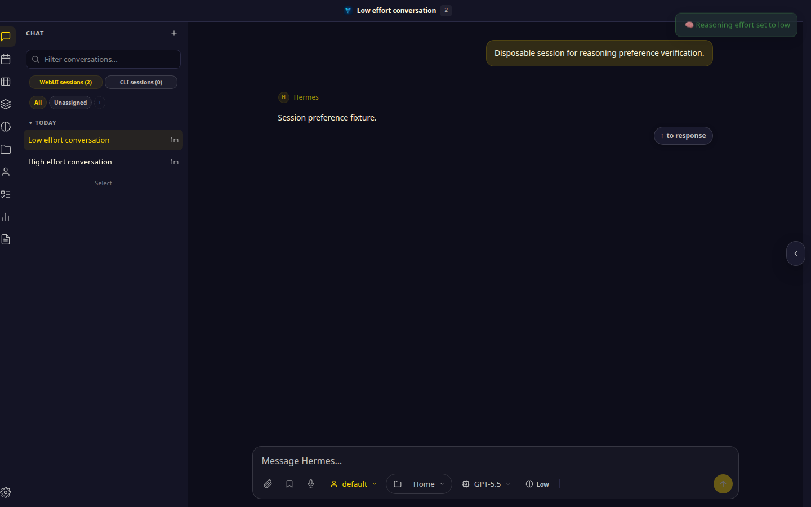
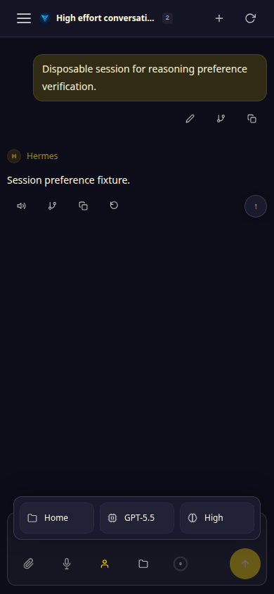

# Per-session reasoning effort: PR #7881

Actual app screenshots from the revision before the PR (`c296673e`) and the
review-fix revision (`57c1fef3`). The two disposable conversations use GPT-5.5
with different effort selections. No provider request was made; these captures
verify browser controls and session state, not external model behavior.

Sequence: select High in conversation A, select Low in conversation B, then
switch back to A through the sidebar.

## Desktop: 1440 × 900

Before the PR, A displays Low after returning from B:

After the PR, A restores High:

B displays its selected Low effort:

## Mobile: 390 × 844

The hamburger sidebar and mobile configuration action are used for the same
A High → B Low → A sequence. The configuration panel is open so both model and
effort are visible.

Before the PR, A displays Low:

After the PR, A restores High:

B displays Low:

## Observed assertions

- Before: returning to A displays Low at both widths; the reasoning POST has no
  session identity.
- After: returning to A restores High, revisiting B restores Low, and reloading
  A restores High at both widths. The reasoning POST includes the active
  session identity.
- Screenshots are direct browser captures from disposable fixture sessions.
  No DOM labels were rewritten and no live provider calls were made.
- The same-model fixture demonstrates independent efforts. Different-model
  combinations are described in the PR use case but were not exercised by
  this capture.
